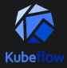

## Kubeflow




**Kubeflow**는 Kubernetes 환경에서 머신러닝 파이프라인을 관리하고 자동화하는 플랫폼입니다. 다양한 머신러닝 프레임워크를 지원하며, 재현 가능한 실험 환경을 제공합니다.

- **설치법**:
  ```sh
  kubectl create namespace kubeflow
  kubectl apply -f https://github.com/kubeflow/manifests/releases/download/v1.8.0/kubeflow.yaml
- 기능:
    - ML 파이프라인의 정의 및 실행
    - 모델의 훈련, 테스트, 배포 관리
    - 다양한 ML 프레임워크 지원 (TensorFlow, PyTorch 등)

- 철학:
    - Kubernetes의 장점을 활용하여 머신러닝 작업을 관리하고 자동화합니다.


[자세한 문서 및 설치 가이드](https://www.kubeflow.org/)